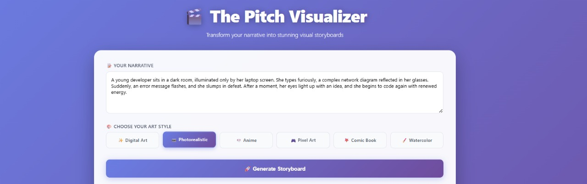
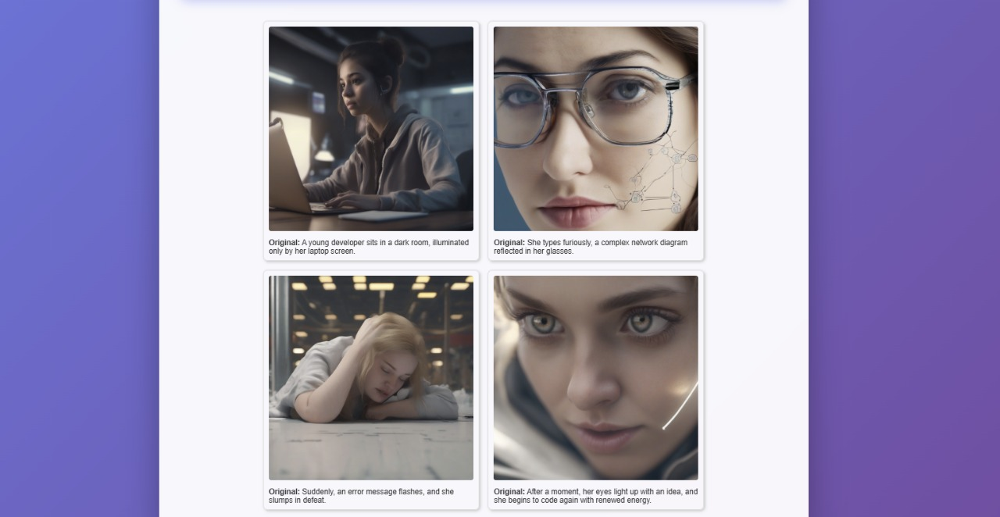

# The Pitch Visualizer

The Pitch Visualizer is a tool to transform your short narrative (3–5 sentences) into a stunning visual storyboard. You can use it either through a **web-based Flask interface** or a **Gradio-hosted notebook interface** powered by Google's Gemini model for prompt engineering and Stable Diffusion for image generation.

---

Here is an example of a storyboard generated by The Pitch Visualizer:

**Scene 1:**  


**Scene 2:**  


## Features

- **Narrative to Storyboard:** Convert your 3–5 sentence story into a visual storyboard.
- **Multiple Art Styles:** Digital Art, Photorealistic, Anime, Pixel Art, Comic Book, Watercolor, and more.
- **Two Interfaces:**
  - **Flask Web App:** Local web interface for narrative input and storyboard generation.
  - **Gradio Notebook App:** Cloud-hosted interface with enhanced AI prompt engineering.

---

## How It Works

1. **Narrative Input:** Enter your short story (3–5 sentences).
2. **Sentence Segmentation:** Each sentence is treated as a scene or panel.
3. **Prompt Engineering:** The Gemini model refines each sentence into a detailed visual prompt.
4. **Image Generation:** Stable Diffusion generates images for each scene based on the prompts.
5. **Storyboard Display:** Original sentences and generated images are displayed together as a visual storyboard.

> **Note:** In the Gradio-hosted version, the first step is entering your narrative query, which is then sent to the Gradio application for processing.

---

## Requirements

- Python 3.10+
- GPU recommended for faster image generation (T4 GPU in Colab suggested)
- Google AI Studio API key (for Gemini model)
- Browser for web-based interface

---

## Setup – Flask Web App

1. **Clone the repository:**

   ```bash
   git clone https://github.com/abhishek4922/the-pitch-visualizer.git
   cd the-pitch-visualizer
   ```

2. **Create a virtual environment and install dependencies:**

   ```bash
   python -m venv venv
   source venv/bin/activate  # Windows: venv\Scripts\activate
   pip install -r requirements.txt
   ```

3. **Run the Flask backend:**

   ```bash
   python app.py
   ```

   Backend runs at `http://127.0.0.1:5000`.

4. **Open the frontend:** Open `index.html` in your web browser.

5. **Generate a storyboard:** Enter your narrative, select an art style, and click “Generate Storyboard.”

---

## Setup – Gradio Notebook

1. Open the notebook in **Google Colab**.
2. **Change runtime type:** Go to **Runtime > Change runtime type > GPU**.
3. **Install dependencies:**
   ```python
   !pip install nltk google-generativeai diffusers transformers accelerate safetensors ipywidgets gradio
   ```
4. **Configure API Key:** Enter your Google AI Studio API key (`GOOGLE_API_KEY`).
5. **Load models** (Gemini + Stable Diffusion).
6. **Run UI cells** to display the Gradio interface.
7. **Enter narrative query** in the text box and select the art style.
8. **Generate storyboard** and view results in the interface.

> **Tip:** Running `iface.launch(share=True)` in Colab provides a public URL to access your Gradio-hosted application.

---

## Project Structure (Flask)
